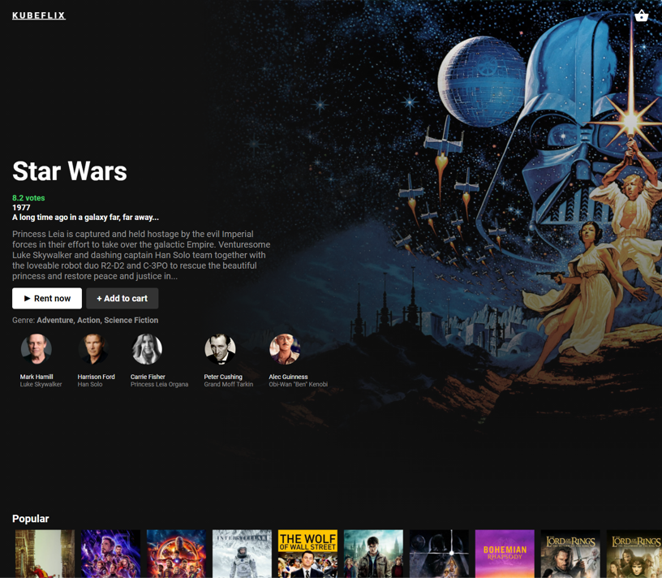
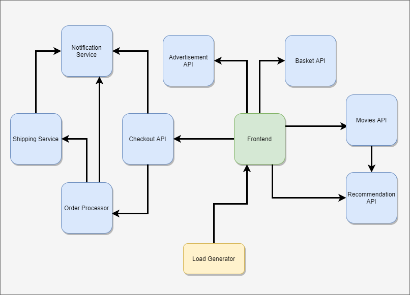

<p align="center">

</p>

## **KUBEFLIX** 
Built to demonstrate a microservices application running on Kubernetes. 
It is composed of 10 microservices written in different languages that talk to each other over http.

**Movie data powered by** <a href="https://www.themoviedb.org/"> </img></a>

## Architecture

</img>

| Service                                              | Language      | Description                                                                                                                       |
| ---------------------------------------------------- | ------------- | --------------------------------------------------------------------------------------------------------------------------------- |
| [frontend](./src/frontend)                           | Next.JS            | Exposes an HTTP server to serve the website.|
| [movies-api](./src/movies-api)                     | C#            | Provides a list of movies from a JSON file.                                                           |                           |
| [recommendation-api](./src/recommendation-api) | Python        | Recommends other movies  
| [load testing](./src/load-generator) | Python        | [Locust](https://github.com/locustio/locust) load testing                         

## Running the application

### Locally with docker-compose
On the root folder of the project you will find the [docker-compose.yaml](./docker-compose.yaml) file. Run the command ```docker-compose up``` to run the full application locally.

### Kubernetes
To run the simple example on the [kubernetes-manifests/simple](./src/kubernetes-manifests/simple) folder.

On the root folder of the project run ```kubectl apply -f /src/kubernetes-manifests/simple```. Or on the [kubernetes-manifests/simple](./src/kubernetes-manifests/simple) folder run ```kubectl apply -f .```