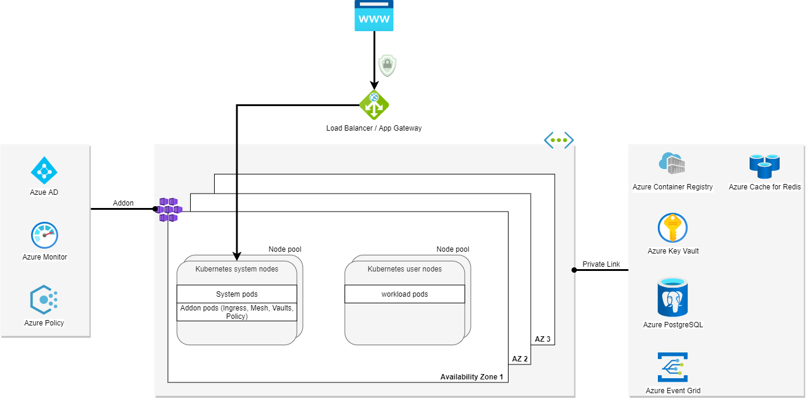

<p align="center">

</p>

## **KUBEFLIX** 
Built to demonstrate a microservices application running on Kubernetes. 
It is composed of 10 microservices written in different languages that talk to each other over http.

**Movie data powered by** <a href="https://www.themoviedb.org/"> </img></a>

## Application architecture

</img>

| Service                                              | Language      | Description                                                                                                                       |
| ---------------------------------------------------- | ------------- | --------------------------------------------------------------------------------------------------------------------------------- |
| [Frontend](./src/frontend)                           | Next.js            | Exposes an HTTP server to serve the website.|
| [Movies Api](./src/movies-api)                     | C#            | Provides a list of movies.                                                           |                           |
| [Basket Api](./src/basket-api) | Go        | Saves basket in Redis.
| [Recommendation Api](./src/recommendation-api) | Python        | Recommends other movies 
| [Advertisement Api](./src/ad-api) | Go        | Api to display advertisement on the frontend 
| [Checkout Api](./src/checkout-api) | C#        | 1 click-checkout api. Grabs basket from Redis and puts orders message in a queue
| [Order Processor](./src/order-processor) | Go        | Processes orders. Stores orders in database and emits order processed event 
| [Notification Service](./src/notification-service) | Go        | Listens to Order processed and Shipped events and sends notifications
| [Shipping Service](./src/shipping-service) | C#        | Listens to order processed events, updates database and emits shipped events 
| [Load Testing](./src/load-generator) | Python        | [Locust](https://github.com/locustio/locust) load testing                         

## Platform architecture
</img>

## Workshop
Workshop and tutorials available [here](https://hjgraca.github.io/kubeflix/docs/)

## Running the application

### Locally with docker-compose
On the root folder of the project you will find the [docker-compose.yaml](./docker-compose.yaml) file. Run the command ```docker-compose up``` to run the full application locally.

#### Building images locally and pushing to a regsitry 
Update the image property in [docker-compose.yaml](./docker-compose.yaml) file and run ```docker-compose build```. 

Pushing images to the registry ```docker-compose push```

### Kubernetes
To run the simple example on the [kubernetes-manifests/simple](./src/kubernetes-manifests/simple) folder.

On the root folder of the project run ```kubectl apply -f /src/kubernetes-manifests/simple```. Or on the [kubernetes-manifests/simple](./src/kubernetes-manifests/simple) folder run ```kubectl apply -f .```